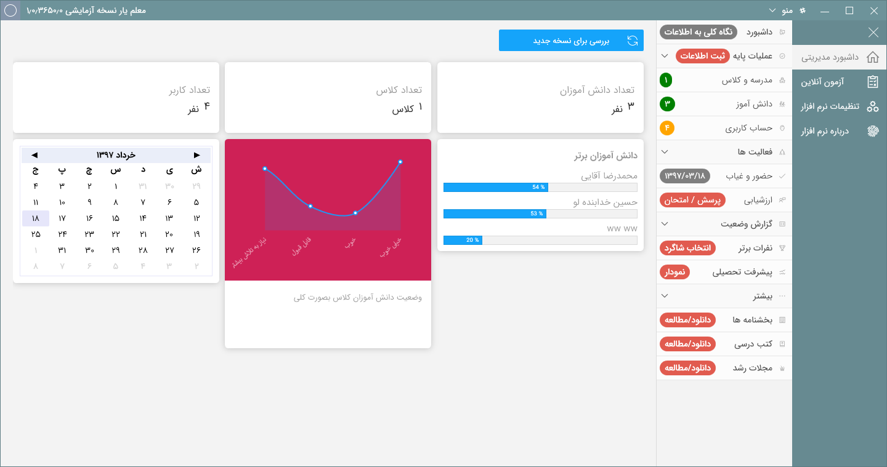
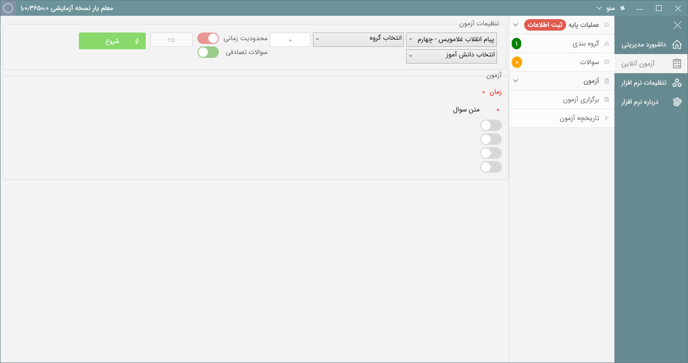
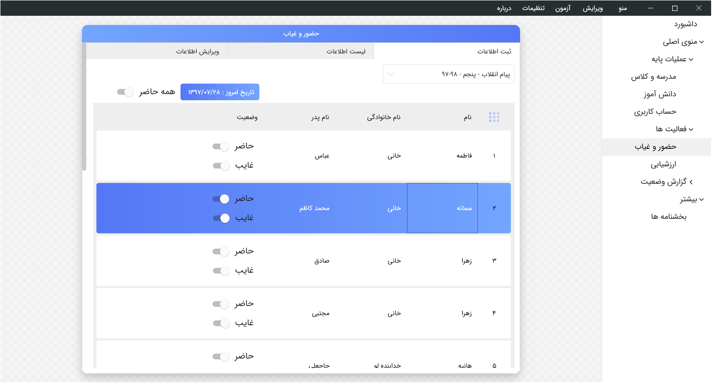
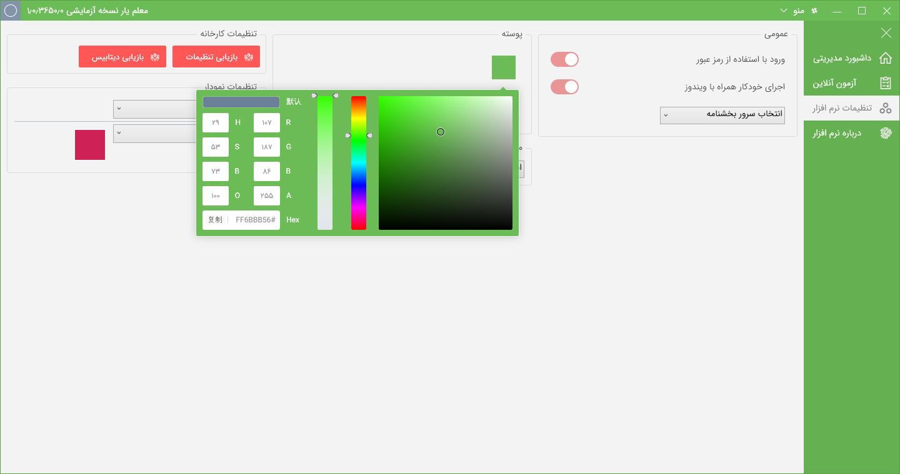
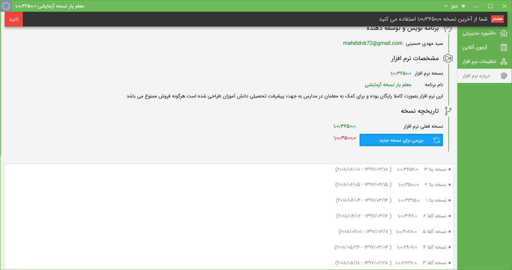
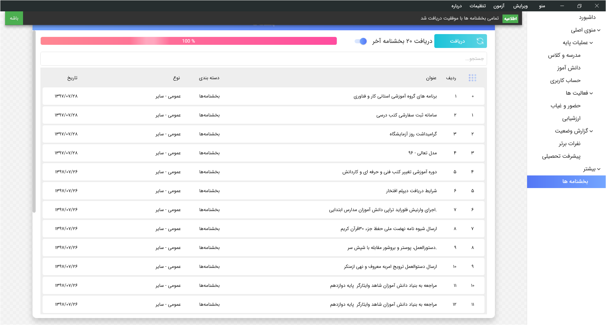

# 
<a href="#en-US">English Readme!</a>

# 
 معلم یار

 

 معلم یار یک پروژه شخصی جهت ساده کردن امور مربوط به مدیریت کلاس و کنترل پیشرفت دانش آموزان می باشد. این نرم افزار کاملا رایگان بوده و برای تهیه آن از کتابخانه های متن باز دیگر استفاده شده است. همچنین این مخزن یک مثال عالی از نحوه استفاده از تکنولوژی بنیاد نمایش ویندوز و طراحی رابط کاربری منعطف می باشد.

# 
 Images | تصاویر

## 
ویژگی ها

 قابلیت ایجاد سال تحصیلی و مدرسه های متعدد
 قابلیت ایجاد دانش آموزان برای هرکلاس با مشخصات + عکس
 دارای امنیت ورود به نرم افزار
 قابلیت حضور غیاب روزانه کلاس
 ارزشیابی دروس بصورت توصیفی
 سیستم هوشمند تشخیص افرادی که پرسش نشده اند
 سیستم پیشرفت تحصیلی هوشمند و پیشرفته با قابلیت مقایسه دانش آموزان در دروس مختلف، امتیازات کلی، و… بصورت نمودار های مختلف
 سیستم پیشرفته مقایسه دانش آموز با خود
 قابلیت تعیین شاگرد های کلاس
 قابلیت ویرایش و حذف اطلاعات
 بسیار سریع و قدرتمند
 دارای سیستم بروزرسانی نرم افزار
 تقویم شمسی زیبا و کامل همراه با روزهای تعطیل رسمی
 و…

## 
دانلود

آخرین نسخه ها را از اینجا دریافت کنید

 [via the releases tab](https://github.com/ghost1372/MoalemYar/releases). 

## 
مشارکت

هرگونه همیاری و کمک در توسعه این برنامه با کمال میل پذیرفته می شود

# 
MoalemYar

A personal project for class management, using various technologies like WPF, Entityframwork, CodeFirst, Sqlite, Migration and more. also this project is An excellent example of working with controls in WPF and GUI.

## Technology used
VisualStudio 2017 
Netframwork 4.5.1 
WPF 
Entityframwork 
CodeFirst 
Sqlite 
Migration 

## Open source libraries that have been used
[SQLiteCodeFirst](https://github.com/msallin/SQLiteCodeFirst) written by msallin for Creates a SQLite Database from Code, using Entity Framework CodeFirst. 
[Migrations](https://github.com/digocesar/SQLiteCodeFirst) written by digocesar for migration. 
[JsonSettings](https://github.com/Nucs/JsonSettings) written by nucs for Easiest way you'll ever write settings for your app. 
[VSCode Notifications](https://github.com/Enterwell/Wpf.Notifications) written by Enterwell for WPF notifications UI controls. 
[ThumbnailSharp](https://github.com/mirzaevolution/ThumbnailSharp) written by mirzaevolution for create an image thumbnail from various sources with better result and supports different image formats. 
[Live-Charts](https://github.com/Live-Charts/Live-Charts) written by Live-Charts for Simple, flexible, interactive & powerful charts. 
[sharpcompress](https://github.com/adamhathcock/sharpcompress) written by adamhathcock for deal with many compression types and formats. 
[MVVMC](https://github.com/michaelscodingspot/WPF_MVVMC) written by michaelscodingspot for deal with MVVM and Navigation System
 
[PersianCalendarWPF](https://github.com/ghost1372/PersianCalendarWPF) written by Mahdi Hosseini for deal with Persian Calendar and Date also Use Hijri date based on the algorithm of this project [DroidPersianCalendar](https://github.com/ebraminio/DroidPersianCalendar) written by Ebrahim Byagowi

## Download
 [via the releases tab](https://github.com/ghost1372/MoalemYar/releases). 

## Compile
for Compile this Project you need Visual Studio 2017

## Version 1
for using version 1 you must change master branch to version-1 branch.

## Old Version
you can access Old Version from this repo. this version written by C# and Winform.
https://github.com/ghost1372/ClassSRM
